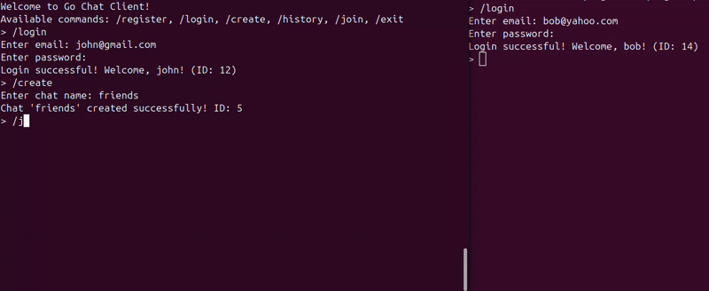

## Go streaming chat 

### Демонстрация



### Назначение
Сервис предоставляет API для обмена сообщениями в чатах в режиме реального времени (gRPC streaming) с поддержкой аутентификации пользователей. Архитектура ориентирована на расширяемость (новые типы событий, приватные чаты, масштабирование Hub).

### Связанные репозитории
В этом репозитории представлена серверная часть. Протокол и клиент находятся отдельно:
* Протоколы (protobuf): https://github.com/grigory222/go-chat-proto
* Клиент: https://github.com/grigory222/go-chat-client

### Технологии
Go | gRPC | Protobuf | PostgreSQL | pgx | JWT | bcrypt | slog | cleanenv

### Основные возможности
* JWT: access / refresh токены
* Создание чатов
* Хранение истории сообщений
* Двунаправленный gRPC stream для доставки новых сообщений
* Интерсептор авторизации
* Изолированный слой хранения
* Hub: неблокирующая широковещательная рассылка
* Юнит-тесты сервисного слоя


### Быстрый запуск
```bash
docker compose up -d
go run ./cmd/server
```

### API
Ниже перечислены методы и их назначение. Подробные сигнатуры и типы см. в protobuf (`go-chat-proto`).

AuthService
* Register – создание нового пользователя
* Login – проверка учётных данных и выдача пары токенов (access + refresh)
* RefreshToken – получение нового access токена по действующему refresh

ChatService
* CreateChat – создаёт чат и автоматически добавляет инициатора
* GetHistory – постраничная выборка истории сообщений (проверяется членство в чате)
* JoinChat – устанавливает streaming-сессию для отправки и получения новых сообщений в реальном времени

JoinChat (процесс):
1. Первое входящее сообщение клиента содержит `chat_id` (регистрация подключения).
2. Далее клиент отправляет текстовые сообщения.
3. Сервер сохраняет сообщение и отправляет его остальным участникам чата (кроме отправителя).

Сообщение (`Message`): `id, chat_id, user_id, user_name, text, created_at (unix)`.

